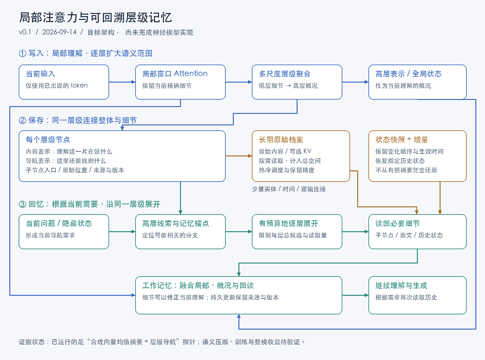
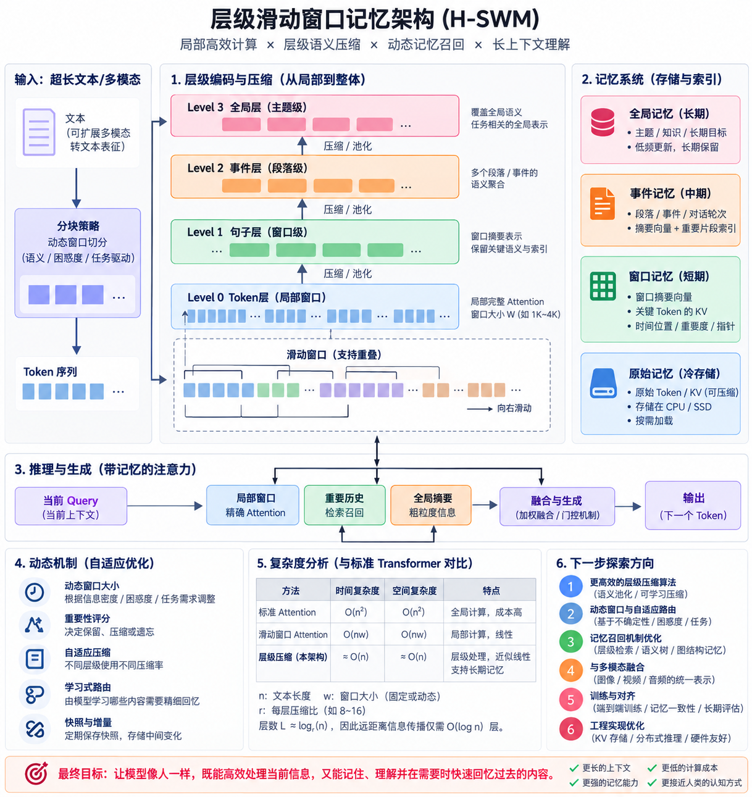

# RCHAM Research Archive

## Retrieval-Conditioned Hierarchical Attention Memory

> ⚠️ **Research status: FROZEN / ARCHIVED**
>
> This repository preserves an independently conceived long-context Attention / KV-memory research hypothesis, its prior-art audit, prototype experiments, experiment failures, and methodological corrections.
>
> The central real-model hypothesis has neither been validated nor adequately falsified. The project is currently frozen because the available evidence does not justify the cost of a full implementation. Future researchers are welcome to inspect, reproduce, criticize, or redesign the experiments.

> ⚠️ **研究状态：FROZEN / ARCHIVED（暂时冻结 / 归档）。**
>
> 本仓库公开保存一个独立提出的长上下文 Attention / KV-memory 架构假设，以及文献审计、实验、失败结果和后续源码复核。核心真实模型假设目前既没有得到验证，也没有被充分证伪。当前冻结是研究资源决策，而不是宣布该方向失败。欢迎后续研究者复现、质疑或重新设计实验。

当前决策及重启条件见 [项目状态](research/PROJECT_STATUS.md)；证据见 [源码复核](research/reports/research_closeout.md) 和 [结项档案](research/closeout/README.md)。当前没有计划开展新实验。下文是 v0.1 历史设计与结果，不是待执行计划。

**架构版本：v0.1 · 首次仓库留档日期：2026-09-14**

研究目标：借鉴 CNN 从局部到整体的层级组织，用局部 Attention 和逐层压缩降低全局两两计算的开销；同一层级保留细节入口，需要历史时由粗到细展开，把必要信息送回当前计算。

> 理解时向上压缩，回忆时向下展开；用同一套层级连接整体与细节。

这是研究设计与实验档案。现已完成无训练的合成向量导航预实验；可训练语义压缩、模型内部 Attention 替换和整模收益尚未验证。



### 概念架构图

下面的图是项目早期的概念示意，用于解释“局部窗口 → 多尺度压缩 → 记忆分层 → 按需召回”的直觉。它不是已经实现或验证的 Transformer 架构；图中复杂度、动态窗口和多模态等内容均属于未验证设计假设。



也可查看[可编辑的 Mermaid 架构图](docs/figures/architecture-v0.1.mmd)和[早期 SVG 图](outputs/architecture-v0.1.svg)。

## 阅读入口

| 文件 | 内容 |
|---|---|
| [架构设计 v0.1](docs/architecture-v0.1.md) | 原始目标、模块、写入和回读流程、复杂度条件与未决问题 |
| [实验假设](docs/experiment-hypotheses.md) | 可检验假设、对照、预算、指标与结论边界 |
| [思想与版本记录](docs/design-history.md) | 原始架构主张、后续建议、v0.1 已实现范围 |
| [完整实验计划](outputs/research_plan.md) | 从组件验证到小型语言模型的实施路线 |
| [最新预实验结果](outputs/compression_probe/README.md) | 原始输出解读、局限、复现方法 |
| [架构图 SVG](outputs/architecture-v0.1.svg) / [Mermaid 源码](docs/figures/architecture-v0.1.mmd) | 可查看和编辑的图 |

## 已运行的结果

4,096 条合成记录；每题最终读回 64 条原始记录；每个场景 9 段历史、180 个问题。两种方法共用相同索引和原始档案。

| 场景 | 全扫描叶块摘要 | 树形搜索，每层全局最多 4 个候选 |
|---|---:|---:|
| 随机向量 | 37.22% | 17.78% |
| 同主题聚集 | 72.78% | 72.78% |
| 同一批主题记录打散 | 12.22% | 8.89% |

数值是目标证据召回率，不是语言模型答题成绩。分层方法给 52 个导航向量打分，平坦方法给 256 个打分；本次 Python 原型的树形查询实际仍更慢。结果揭示分组、均值压缩和逐层剪枝的影响，不证明完整架构成功。

全部结果覆盖 3 个长度、3 个场景、7 个方法，共 11,340 条方法评测记录。1,620 个场景—问题实例包含相同问题在不同排列下的配对，不能算作独立问题。数据、代码与失败轨迹保存在 [outputs/compression_probe](outputs/compression_probe)。

## 复现

已验证环境为 Python 3.14.7、NumPy 2.4.2。可使用独立环境安装锁定依赖，然后运行：

```bash
python3 -m pip install -r requirements.txt
python3 outputs/compression_probe/probe.py --output-dir work/reproduction
```

脚本不调用 API、不下载模型。新输出写入忽略目录，不覆盖已提交结果；召回和操作计数应可复现，墙钟耗时随环境变化。源代码开头保存随机种子、维度和树参数。

[快照清单](outputs/compression_probe/manifest.json) 记录已归档实验文件的 SHA-256 与复现核对状态。

## 版本约定

- `docs/architecture-v0.1.md` 是本次设计快照；未来实质修改另存 `architecture-v0.2.md` 等，并更新思想与版本记录。
- 以后实验使用新的结果目录，不覆盖本次归档数据。
- 每次提交说明改动的假设、实现和证据范围。失败结果同样保留。
- 已配置远程仓库 `https://github.com/roclee2692/rcham-long-context-memory`；本地 commit 与远端发布状态需分别核验。
- 架构原始主张来自用户在本次讨论中的陈述；文档、优化建议和实验脚本由 AI 协助整理，未将未经实验的建议记为已证实成果。
